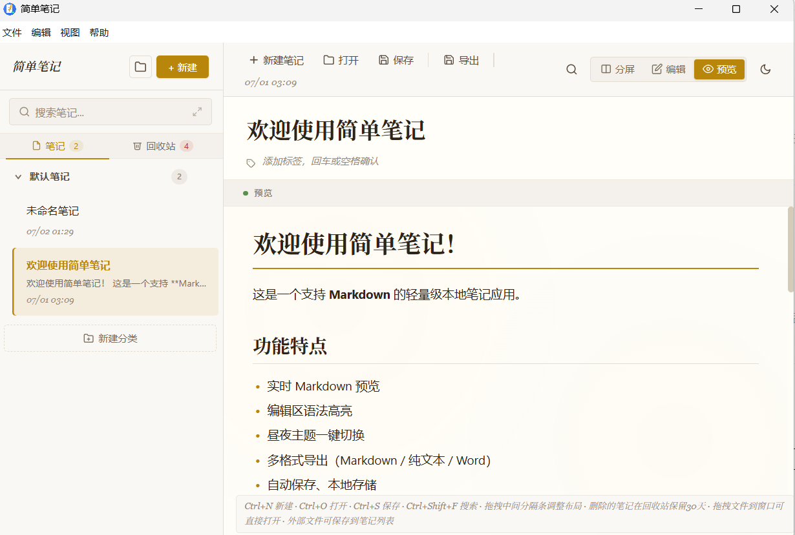

<!-- Generated by Trae Work -->

# 简单笔记

### 零配置 · 零学习 · 零负担

**打开就写，写完就走。** 温暖书本风，回归写作本身。

*A lightweight, beginner-friendly Markdown note app for Windows.*

 

 

 

[⬇ 安装版 (85.6MB)](https://github.com/ohhhss/simple-notes/releases/download/v1.0.0/-1.0.0-win-x64.exe) &nbsp;&nbsp;·&nbsp;&nbsp; [⬇ 便携版 (85.5MB)](https://github.com/ohhhss/simple-notes/releases/download/v1.0.0/-1.0.0-Portable.exe) &nbsp;&nbsp;·&nbsp;&nbsp; [⭐ Star](https://github.com/ohhhss/simple-notes)

 

完全免费 · 无广告 · 无需注册 · 数据不上云

---

## 为什么选择简单笔记

| 🎯 新手友好 | ⚡ 轻量快速 |
|:---:|:---:|
| 工具栏一键格式化， 不用记任何语法 | 仅 85MB（同类软件 1/3 大小）， 秒启动，不卡顿 |
| **👁 实时预览** | **🔒 本地安心** |
| 左边写、右边看，自动同步滚动， 三种视图自由切换 | 数据全存你电脑，不上云， 回收站 30 天防误删 |

---

## 功能一览

**写作体验**
- ✍️ 实时预览，编辑器语法着色，写出来的效果立刻看到
- 🛠 快捷工具栏，一键插入标题、粗体、列表、引用、链接、图片
- 📐 可拖拽分栏，三种视图模式（左右分屏 / 仅编辑 / 仅预览）
- 🔄 编辑区滚动时预览区自动跟随，阅读长文不迷路
- 🌓 昼夜主题一键切换，暖色护眼
- 🖼 支持 Markdown 图片语法，预览区直接显示图片

**笔记管理**
- 📂 分类管理，像文件夹一样自由组织笔记
- 🏷 标签系统，写 `#关键词` 自动归类
- 🔍 全局搜索，按内容、标签、时间快速找到笔记
- 🗑 回收站保护，误删笔记 30 天内可还原
- 💾 自动保存 + 手动保存 (Ctrl+S)，不怕断电丢失

**文件互通**
- 📥 打开 `.md` / `.txt` / `.docx` 文件，Word 文档自动转换
- 📤 导出为 Markdown / 纯文本 / Word 格式
- 🖱 拖拽文件到窗口直接打开
- 📋 外部打开的文件可一键保存到笔记列表

---

## 快捷键

| 快捷键 | 功能 |
|:---|:---|
| `Ctrl + N` | 新建笔记 |
| `Ctrl + O` | 打开文件 |
| `Ctrl + S` | 保存笔记 |
| `Ctrl + Shift + F` | 搜索笔记 |
| `Ctrl + B` | **粗体** |
| `Ctrl + I` | *斜体* |
| `Ctrl + K` | 插入链接 |
| `Ctrl + 1 / 2 / 3` | 一级 / 二级 / 三级标题 |
| `F11` | 全屏切换 |

---

## 下载

支持 64 位 Windows 10 / 11，提供两个版本：

| 版本 | 大小 | 说明 |
|:---|:---|:---|
| [⬇ 安装版](https://github.com/ohhhss/simple-notes/releases/download/v1.0.0/-1.0.0-win-x64.exe) | 85.6 MB | 双击自动安装，创建桌面快捷方式，推荐日常使用 |
| [⬇ 便携版](https://github.com/ohhhss/simple-notes/releases/download/v1.0.0/-1.0.0-Portable.exe) | 85.5 MB | 免安装，放 U 盘随身携带，双击即用 |

> 前往 [Releases 页面](https://github.com/ohhhss/simple-notes/releases/tag/v1.0.0) 查看更新日志。

---

## 常见问题

**Q: 笔记数据存在哪里？怎么备份？**
A: 笔记保存在你电脑的用户数据目录下。可以通过菜单「文件 → 导出备份」导出 JSON 备份文件，防止数据丢失。

**Q: 不会 Markdown 能用吗？**
A: 完全可以。工具栏提供了所有常用格式的一键按钮，不用记任何符号；实时预览让你写出来什么效果立刻看到。

**Q: 有手机版吗？能云同步吗？**
A: 目前只有 Windows 版，不做云同步。如果你需要多设备同步，可以把笔记文件放到 OneDrive / 百度网盘等同步盘目录中。

**Q: 软件界面是中文的吗？**
A: 是的，全中文界面。

**Q: 遇到问题去哪反馈？**
A: 欢迎在 [GitHub Issues](https://github.com/ohhhss/simple-notes/issues) 反馈问题或提出建议。

---

**简单笔记** © 2026 [ohhhss](https://github.com/ohhhss) · [MIT License](LICENSE)

 

如果这个项目对你有帮助，欢迎 ⭐ Star 支持！

[⬆ 回到顶部](#简单笔记)

